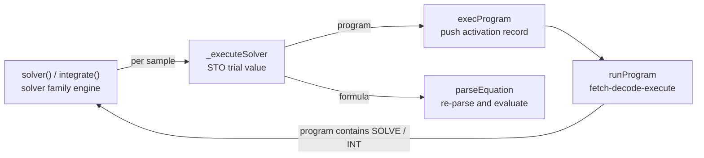

# The High-Level Modules

Audit basis: upstream `b18a42df723108e9a771153692de923da7e4f8d3`, 2026-07-22.

C47's directory names describe files, not systems, and that hides what the
program actually contains. This page is the inventory of the **high-level
modules** - each named by its canonical domain term, with the structure a
maintainer needs before opening the files - so that when a module needs work,
the right references and patterns can be found instead of reinvented. The
curated links live in [06-references.md](06-references.md); the layering and
dependency evidence in [00-architecture.md](00-architecture.md) Section 2; the
file-by-file map and the key-to-screen control flow in
[01-codebase.md](01-codebase.md). This page does not restate those - where a
fact lives there, it is cited, not copied.

The headline that is easy to miss: **C47 embeds several complete language
surfaces, not one**, plus numeric, interaction, presentation and persistence
machines. Every one of them runs against the embedded constraints of a
96 KiB-RAM, small-stack STM32 target - one shared memory pool, no OS services,
recursion reachable from user input - so "best practice" for each module means
its embedded-world form, not the desktop form.

## 1. The language surfaces

Five distinct input languages, each with its own scanner or parser:

| surface | what it is, technically | components | literature term |
|---|---|---|---|
| the keystroke program language | a byte-code programming language: variable-length encoding (1-2 byte opcodes, high bit marks the second byte; typed operands - register, indirect, label/name string, type-tagged literals) | `items.h`, `defines.h:1408` | bytecode / VM instruction-set design |
| - its interactive assembler | PEM records keystrokes as byte-code steps instead of running them; stepwise insert/delete | `programming/manage.c`, `items.c:718` | keystroke programming (HP-41/42 model) |
| - its disassembler | byte-code back to listing text for the editor and browser | `programming/decode.c` | disassembly / listing generation |
| - its virtual machine | fetch-decode-execute loop with a program counter (`currentStep`), GTO/XEQ/RTN, predicate-skip conditionals, and pool-allocated **activation records** | `programming/lblGtoXeq.c:750`, `nextStep.c` | interpreter main loops; activation records / call frames |
| - its symbol tables | global/local label scan (`labelList`, `programList`), named variables | `programming/manage.c:122` | symbol table management |
| the EQN formula language | infix expression entry, parsed and evaluated against the register model; feeds the solver, grapher and integrator; edited in EIM, stored in `allFormulae` | `solver/equation.c` | expression parsing and evaluation |
| the number-entry lexer | NIM tokenizes keystrokes into typed literals - integer bases, exponents, fractions, complex parts, angles - sharing one buffer with alpha entry | `bufferize.c:445` | lexing / tokenization |
| the automation DSL | the test binary embeds a **Jim Tcl interpreter**; calculator-specific commands (`readp`, `xeq`, `press`, `reg`, `snap`...) drive the machine headlessly | `dep/jimtcl`, `src/t47/dsl.c` | embedded extension languages (the Tcl model) |
| the serialization formats | line-oriented text containers for programs (`.p47`), registers and full state, with a screening pass before anything is loaded | `saveRestorePrograms.c`, `saveRestoreBackup.c`, `saveRestoreCalcState.c` | serialization; parse-before-commit file screening |

A sixth, smaller surface: **programmable menus** - a running program can define
the softmenu the user sees. Its record is `programmableMenu_t`
(`typeDefinitions.h:640`): 18 item names and 21 item parameters where the
**MSB set means XEQ and MSB clear means GTO** - the menu is literally a jump
table into the user's program.

### 1.1 Structure: the program machinery

**The store.** Programs are one contiguous byte stream in the pool, programs
separated by `END`, the whole area terminated by the two-byte `.END.`;
[01-codebase.md](01-codebase.md) Section 10 owns the byte-walk details. Every
edit or load re-derives the symbol tables by a single forward scan,
`scanLabelsAndPrograms()` (`manage.c:122`): `labelList_t` records
`{program, step, labelPointer, instructionPointer}` where **`step < 0` marks a
local label and `step > 0` a global one** (`typeDefinitions.h:650`), and
`programList_t` records each program's first step. The scan stops at the first
step it cannot decode - so does the step walker (`decode.c:104`) - which means
a corrupt byte silently truncates the visible program list rather than
erroring.

**The assembler.** PEM is not a text editor: each keystroke resolves to an
item, and in PEM the dispatcher records the item as byte-code instead of
running it (`items.c:718`, the `calcMode == CM_PEM` branch). Insert and delete
shift the byte stream and re-scan.

**The virtual machine.** `runProgram` (`lblGtoXeq.c:891`) is the
fetch-decode-execute loop: fetch at `currentStep`, widen two-byte opcodes,
execute through the same `reallyRunFunction` dispatch the keyboard uses
([00-architecture.md](00-architecture.md) Section 4), then advance by the
step's decoded length. Subroutine state is a **doubly-linked list of
pool-allocated activation records**, `subroutineLevelHeader_t`
(`typeDefinitions.h:466`): return program + step, counts of local flags and
registers (whose storage is appended directly behind the header,
`lblGtoXeq.c:191`), and next/previous level pointers. Two invariants a
maintainer needs:

- `returnProgramNumber` is signed: **negative means the return address is in
  FLASH, positive in RAM** (`typeDefinitions.h:467`).
- every `fnExecute` from a running program pushes one level
  (`lblGtoXeq.c:167`), and only the program's own RTN/END pops it. **An
  aborted nested run leaves its pushed levels allocated** (measured at the
  audit basis) - the return entries then reference the halted programs, and
  they dangle once program memory moves. A gap, not a design.

**The disassembler.** `decode.c` walks the same encoding backwards into
listing text, taking command names from the item table - so the listing is
correct exactly as far as `indexOfItems[]` is, and a parameter byte it does
not recognise ends the walk (the same truncation-on-corruption behaviour as
the scanner).

### 1.2 Structure: the EQN formula language

The parser (`equation.c`) is a **single-pass operator-precedence evaluator
with an explicit operator stack** - the shunting-yard family - reducing
through `_processOperator` (`equation.c:874`), with parenthesis and
absolute-value-bar matching and a hard operator-stack overflow check
(`equation.c:1004`). It has exactly two modes (`equation.h:14`):
`EQUATION_PARSER_MVAR` scans the formula only to build the variable menu, and
`EQUATION_PARSER_XEQ` evaluates it against the registers. Formulae live in the
pool as `formulaHeader_t` records - a block pointer and a size
(`typeDefinitions.h:505`). There is no compiled form: **every evaluation
re-parses the text**, once per solver sample or plot point.

### 1.3 Structure: the automation DSL

`t47` embeds Jim Tcl whole (`dep/jimtcl`) and registers the calculator
commands in one table (`dsl.c:1300`): state (`reg`, `var`, `flag`,
`loadst`/`savest`), programs (`readp`, `xportp`, `xeq`), input (`press`,
`nim`, `item`), capture (`snap`). Everything a script can do funnels into the
same dispatch and key paths as the keyboard - the DSL adds no second
semantics. Upstream's `res/SCRIPTS/cli_automation_examples.txt` is the usage
reference ([06-references.md](06-references.md)). One trap this repo has hit:
`var x` resolves single letters as *register* names before named variables,
so `[var x]` reads stack register X - do not use it as evidence about a named
variable `x`.

## 2. The numeric engines

| engine | what it is, technically | components | literature term |
|---|---|---|---|
| decimal arithmetic | 34-digit IEEE 754-2008 decimal floating point - the value type of the whole machine | `dep/decNumberICU` | General Decimal Arithmetic (Cowlishaw) |
| bignum integers | arbitrary-precision long integers | GMP, `longIntegerType.c` | arbitrary-precision arithmetic |
| root finder | Brent's method with a Newton polish option | `solver/solve.c:463` | Brent's method / derivative-free root finding |
| quadrature | double-exponential (tanh-sinh) integration | `solver/integrate.c:350` | Takahasi-Mori double-exponential transformation |
| numeric differentiation | finite differences over a program or formula | `solver/differentiate.c`, `solver/finite_differences.h` | finite-difference stencils |
| summation/product | programmed series evaluation | `solver/sumprod.c`, `solver/isumprod.c` | - |
| financial solver | time-value-of-money equation solving | `solver/tvm.c` | TVM equations |
| linear algebra | real/complex matrix arithmetic, decompositions, eigenvalues (QR iteration) | `mathematics/matrix.c` | numerical linear algebra |
| elementary and special functions | the scalar mathematics tree: Bessel, gamma, erf, AGM... | `mathematics/` | special-function computation |
| statistics and fitting | accumulated sums, regression / curve fitting | `stats.c`, `curveFitting.c` | statistical computing |
| probability distributions | PDF/CDF/quantile per distribution | `distributions/` | statistical distribution algorithms |
| unit and angle conversion | conversion tables and angular-mode arithmetic | `conversionUnits.c`, `conversionAngles.c` | - |
| fractions, dates, times | exact fraction display, calendar arithmetic | `fractions.c`, `dateTime.c` | calendrical calculation |

### 2.1 Structure: the value model every engine shares

A register is a 32-bit descriptor, `registerHeader_t`
(`typeDefinitions.h:412`): a 16-bit pool block pointer, a 4-bit data type and
a 5-bit tag (angular mode, integer base or sign). The consequences:

- **the type system is 4 bits** - every engine dispatches on `dataType_t`
  through per-operation tables ([01-codebase.md](01-codebase.md) Section 6
  owns the data model);
- a matrix header packs rows and columns into **12 bits each**
  (`typeDefinitions.h:431`), so 4095 is the hard dimension limit;
- values are 34-digit decimal128 at rest, but the engines compute in wider
  working contexts (e.g. the solver's `ctxtSolver`, `solve.c`) and round on
  store.

### 2.2 Structure: the re-entrant solver family

The solver-family engines take a **user program (or formula) as their
function argument** and evaluate it by re-entering the VM - programs are
first-class callables. The cycle, which is the single most bug-prone
structure in the machine:

Because the loop closes, nesting is user input: upstream deliberately enables
SOLVE(SOLVE) and PLOT(SOLVE). The engines share the bookkeeping counter
`currentSolverNestingDepth` and the FLAG_SOLVING/FLAG_INTING flag dance on
entry and exit (`integrate.c:1578`, `solve.c`), progress display runs only at
depth 1 (`solve.c:404`), and the integrator carries the depth cap that stops
a self-referential nest from overflowing the C stack (`defines.h`,
`MAX_INTEGRATOR_NESTING_DEPTH`; the escape analysis and the stack-budget
question live in [06-references.md](06-references.md), "Recursion guards on
an embedded C stack"). The grapher evaluates per pixel through
`_executeSolverReal` (`graph.c:102`) - **outside any depth cap** at the audit
basis: a gap, not a design.

## 3. The interaction machine

| module | what it is, technically | components |
|---|---|---|
| keyboard driver | key matrix to key code, shift planes (f/g), long-press and repeat timing | `keyboard.c`, `c47.c:430` `convertKeyCode`, `c47Extensions/keyboardTweak.c` |
| key assignment | user remapping of keys to items (ASN), with its browser | `assign.c`, `browsers/asnBrowser.c` |
| operand entry | TAM - the state machine that collects an instruction's operand (register, digit, name, indirect) after the key | `bufferize.c`, `tamState_t` |
| the modal editors | AIM (alpha), NIM (number), MIM (matrix), EIM (equation), PEM (program) - five modal input surfaces over one buffer | `bufferize.c`, `ui/matrixEditor.c`, `programming/`, `calcMode.c` |
| program-user dialogue | INPUT (prompt for a variable mid-program), PAUSE, key polling | `programming/input.c`, `timer.c` |
| undo | pre-operation state snapshot and rollback | `stack.c`, `saveRestoreCalcState.c` |

### 3.1 Structure

**TAM** is an explicit state machine in one struct, `tamState_t`
(`typeDefinitions.h:672`): the pending `function`, digit accumulator
(`digitsSoFar`, `value`), the `[min, max]` range the operand is clamped to,
and mode bits for alpha, dot, colon and **indirection** (`value0` keeps the
pre-indirection value). The documented invariant: **`tam.mode` non-zero is
the definition of "TAM is active"** - test that, not `calcMode`.

**One buffer, five editors.** All modal entry shares `aimBuffer`
([00-architecture.md](00-architecture.md) Section 2.1 owns that fusion and
its cost); `addItemToBuffer` (`bufferize.c:445`) routes by mode. The key-to-
screen control flow, including where assignments and shift planes resolve, is
[01-codebase.md](01-codebase.md) Section 10 - user key assignments live in
the config as `kbd_usr[37]` (`typeDefinitions.h:328` block), one entry per
physical key.

**R/S and EXIT double as the computation interrupt**: `exitKeyWaiting()`
(`c47Extensions/addons.c:1102`) is polled inside the solver, integrator,
grapher and other long loops. The engines also clear the pending key code at
entry (`solve.c:458`), so an interrupt key landing exactly between two nested
evaluations is discarded - state the limit: the abort is only as responsive
as the polling points.

## 4. The presentation machine

| module | what it is, technically | components |
|---|---|---|
| screen compositor | the LCD frame buffer, damage-driven refresh, the register lines | `screen.c:5993` `refreshScreen` |
| status bar | mode annunciators on a timer cadence | `statusBar.c` |
| number formatter | value to glyph string: FIX/SCI/ENG, grouping, fractions, bases | `display.c:228` |
| font and glyph engine | four bitmap fonts (standard, numeric, numeric bold, tiny), glyph lookup by codepoint, multi-byte strings | `fonts.c`, `charString.c`, `src/generated/` fonts |
| softmenu and catalog system | the menu stack, sorted catalogs of every item, dynamic menus | `softmenus.c`, `src/generated/softmenuCatalogs.h` |
| browsers | full-screen viewers for registers, flags, fonts and assignments | `browsers/` |
| grapher rendering | function/stat plot rasterization into the same frame buffer | `solver/graph.c`, `plotstat.c`, `c47Extensions/graphs.c`, `c47Extensions/graphText.c` |

### 4.1 Structure

The screen is a fixed 400x240 frame buffer (`defines.h:1460`), shared by the
register lines, the softmenus, the browsers and the grapher - there is no
layering or clipping system; whoever draws last owns the pixels, and
`refreshScreen` recomposes by redrawing regions. Text is drawn from four
`font_t` bitmap fonts (`c47.h:275`); glyph lookup is a binary search on
codepoint with **no id fallback, so a miss is always a miss**
(`fonts.c:40`) - the multi-byte string encoding it serves is owned by
`charString.c`.

Menus are two parallel structures (`typeDefinitions.h:526`, `:548`): static
`softmenu_t` entries - where **`menuItem` is always negative** and `numItems`
must be a multiple of 6, one softkey row - and a `softmenuStack_t` of open
menus recording the scroll position (`firstItem`) and the calc mode that
opened each level. The catalogs are generated at build time into
`src/generated/softmenuCatalogs.h` and must stay sorted; the testSuite checks
that ordering on startup.

The only screen content CI asserts is the grapher's SNAP bitmaps
([03-testing.md](03-testing.md)); everything else on this surface is
untested - a gap, not a design.

## 5. The persistence machine

| module | what it is, technically | components |
|---|---|---|
| full-state save/restore | the whole RAM image as a text file (`backup.cfg` and named state files) | `saveRestoreBackup.c`, `saveRestoreCalcState.c` |
| program files | export/import of single programs (`.p47`) | `saveRestorePrograms.c` |
| register import/export | registers and named variables to text | `c47Extensions/textfiles.c` |
| printing | HP 82240-style IR printer output | `printing/` |

### 5.1 Structure

The formats are line-oriented text: a keyword line, a value line, then
payload (one byte per line for programs). The program loader is the model
citizen: it **screens the whole file before reserving a single block**
(`_programFileRefused`, `saveRestorePrograms.c:168`, applied at `:688`), so a
refusal needs no rollback - the LangSec recognize-before-process shape
([06-references.md](06-references.md)). The full-state restore path is not:
`restoreCalc` reads the RAM image back essentially unscreened
(`saveRestoreBackup.c:826`), trusting the file to be well-formed - a gap, not
a design, and the reason the harness fuzzes that path
([05-ci.md](05-ci.md)).

## 6. How to use this page

When a module needs a fix, a redesign, or a review, search its **literature
term** first - each of these is a decades-deep domain with settled embedded
patterns (dispatch techniques for the VM, screened two-pass loading for the
serializers, single-stack recursion budgets for the re-entrant engines,
damage-tracking for the compositor). [06-references.md](06-references.md)
carries the vetted starting points: the embedded-world pattern references
(coding standards, MCU-budget language VMs, LangSec input screening,
event-driven state machines, GUI draw pipelines, key debouncing, real-time
allocators), interpreters and embedded scripting, calculator-heritage
behavioural references, decimal/bignum arithmetic, and the
numerical-algorithms canon. What it does not yet carry, add there - one
owner per fact: this page names the modules, 06 holds the links.
